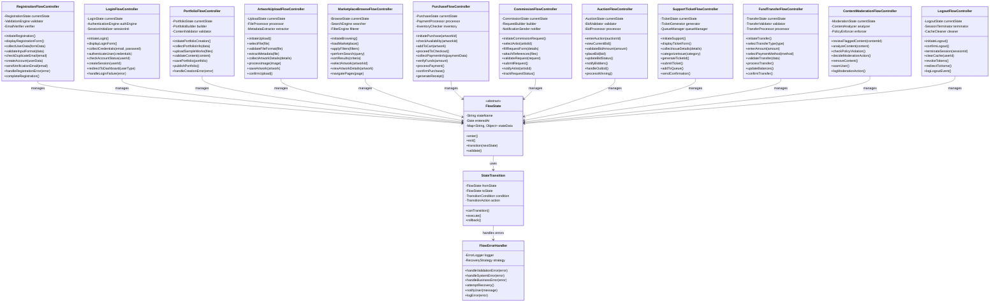

# ArtX Platform - Activity Flow Controllers (Based on Activity Diagrams)

```mermaid
classDiagram
    %% Registration Flow Controller
    class RegistrationFlowController {
        -RegistrationState currentState
        -ValidationEngine validator
        -EmailVerifier verifier
        +initiateRegistration()
        +displayRegistrationForm()
        +collectUserData(formData)
        +validateInputFormat(data)
        +checkDuplicateEmail(email)
        +createAccount(userData)
        +sendVerificationEmail(email)
        +handleRegistrationError(error)
        +completeRegistration()
    }

    %% Login Flow Controller
    class LoginFlowController {
        -LoginState currentState
        -AuthenticationEngine authEngine
        -SessionInitializer sessionInit
        +initiateLogin()
        +displayLoginForm()
        +collectCredentials(email, password)
        +authenticateUser(credentials)
        +checkAccountStatus(userId)
        +createSession(userId)
        +redirectToDashboard(userType)
        +handleLoginFailure(error)
    }

    %% Portfolio Creation Flow
    class PortfolioFlowController {
        -PortfolioState currentState
        -PortfolioBuilder builder
        -ContentValidator validator
        +initiatePortfolioCreation()
        +collectPortfolioInfo(data)
        +uploadSampleWorks(files)
        +validateContent(content)
        +savePortfolio(portfolio)
        +publishPortfolio()
        +handleCreationError(error)
    }

    %% Artwork Upload Flow
    class ArtworkUploadFlowController {
        -UploadState currentState
        -FileProcessor processor
        -MetadataExtractor extractor
        +initiateUpload()
        +selectFile(file)
        +validateFileFormat(file)
        +extractMetadata(file)
        +collectArtworkDetails(details)
        +processImage(image)
        +saveArtwork(artwork)
        +confirmUpload()
    }

    %% Marketplace Browsing Flow
    class MarketplaceBrowseFlowController {
        -BrowseState currentState
        -SearchEngine searcher
        -FilterEngine filterer
        +initiateBrowsing()
        +loadMarketplace()
        +applyFilters(filters)
        +performSearch(query)
        +sortResults(criteria)
        +selectArtwork(artworkId)
        +viewArtworkDetails(artwork)
        +navigatePages(page)
    }

    %% Purchase Flow Controller
    class PurchaseFlowController {
        -PurchaseState currentState
        -PaymentProcessor processor
        -InventoryChecker inventory
        +initiatePurchase(artworkId)
        +checkAvailability(artworkId)
        +addToCart(artwork)
        +proceedToCheckout()
        +collectPaymentInfo(paymentData)
        +verifyFunds(amount)
        +processPayment()
        +confirmPurchase()
        +generateReceipt()
    }

    %% Commission Request Flow
    class CommissionFlowController {
        -CommissionState currentState
        -RequestBuilder builder
        -NotificationSender notifier
        +initiateCommissionRequest()
        +selectArtist(artistId)
        +fillRequestForm(details)
        +attachReferences(files)
        +validateRequest(request)
        +submitRequest()
        +notifyArtist(artistId)
        +trackRequestStatus()
    }

    %% Auction Participation Flow
    class AuctionFlowController {
        -AuctionState currentState
        -BidValidator validator
        -BidProcessor processor
        +enterAuction(auctionId)
        +viewCurrentBid()
        +validateBidAmount(amount)
        +placeBid(bid)
        +updateBidStatus()
        +notifyBidders()
        +handleOutbid()
        +processWinning()
    }

    %% Support Ticket Flow
    class SupportTicketFlowController {
        -TicketState currentState
        -TicketGenerator generator
        -QueueManager queueManager
        +initiateSupport()
        +displayTicketForm()
        +collectIssueDetails(details)
        +categorizeIssue(category)
        +generateTicketId()
        +submitTicket()
        +addToQueue()
        +sendConfirmation()
    }

    %% Fund Transfer Flow
    class FundTransferFlowController {
        -TransferState currentState
        -TransferValidator validator
        -TransferProcessor processor
        +initiateTransfer()
        +selectTransferType(type)
        +enterAmount(amount)
        +selectPaymentMethod(method)
        +validateTransfer(data)
        +processTransfer()
        +updateBalances()
        +confirmTransfer()
    }

    %% Content Moderation Flow
    class ContentModerationFlowController {
        -ModerationState currentState
        -ContentAnalyzer analyzer
        -PolicyEnforcer enforcer
        +reviewFlaggedContent(contentId)
        +analyzeContent(content)
        +checkPolicyViolation()
        +decideModerationAction()
        +removeContent()
        +warnUser()
        +logModerationAction()
    }

    %% Logout Flow Controller
    class LogoutFlowController {
        -LogoutState currentState
        -SessionTerminator terminator
        -CacheCleaner cleaner
        +initiateLogout()
        +confirmLogout()
        +terminateSession(sessionId)
        +clearCache(userId)
        +revokeTokens()
        +redirectToHome()
        +logLogoutEvent()
    }

    %% Flow State Management
    class FlowState {
        <<abstract>>
        -String stateName
        -Date enteredAt
        -Map~String, Object~ stateData
        +enter()
        +exit()
        +transition(nextState)
        +validate()
    }

    class StateTransition {
        -FlowState fromState
        -FlowState toState
        -TransitionCondition condition
        -TransitionAction action
        +canTransition()
        +execute()
        +rollback()
    }

    %% Error Handling
    class FlowErrorHandler {
        -ErrorLogger logger
        -RecoveryStrategy strategy
        +handleValidationError(error)
        +handleSystemError(error)
        +handleBusinessError(error)
        +attemptRecovery()
        +notifyUser(message)
        +logError(error)
    }

    %% Relationships
    RegistrationFlowController --> FlowState : manages
    LoginFlowController --> FlowState : manages
    PortfolioFlowController --> FlowState : manages
    ArtworkUploadFlowController --> FlowState : manages
    MarketplaceBrowseFlowController --> FlowState : manages
    PurchaseFlowController --> FlowState : manages
    CommissionFlowController --> FlowState : manages
    AuctionFlowController --> FlowState : manages
    SupportTicketFlowController --> FlowState : manages
    FundTransferFlowController --> FlowState : manages
    ContentModerationFlowController --> FlowState : manages
    LogoutFlowController --> FlowState : manages
    
    FlowState --> StateTransition : uses
    StateTransition --> FlowErrorHandler : handles errors
```

