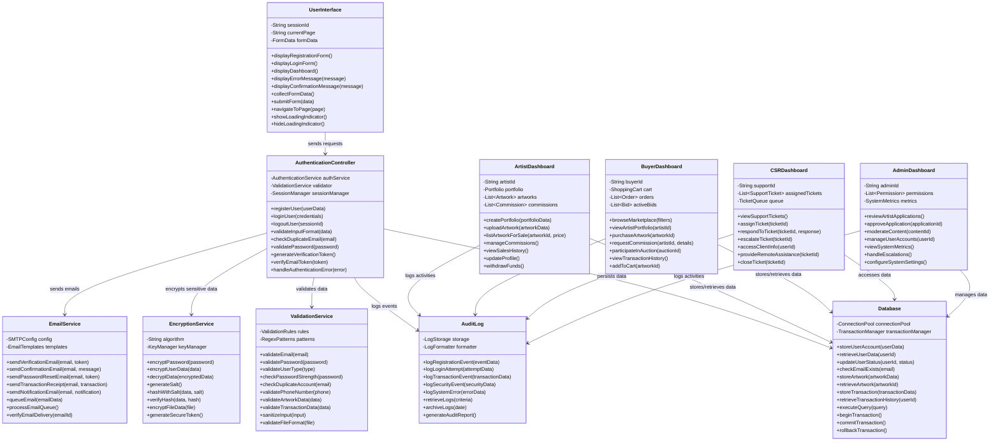

# ArtX Platform - Core System Architecture (Aligned with Sequence Diagrams)

```mermaid
classDiagram
    %% User Interface Layer
    class UserInterface {
        -String sessionId
        -String currentPage
        -FormData formData
        +displayRegistrationForm()
        +displayLoginForm()
        +displayDashboard()
        +displayErrorMessage(message)
        +displayConfirmationMessage(message)
        +collectFormData()
        +submitForm(data)
        +navigateToPage(page)
        +showLoadingIndicator()
        +hideLoadingIndicator()
    }

    %% Authentication Controller
    class AuthenticationController {
        -AuthenticationService authService
        -ValidationService validator
        -SessionManager sessionManager
        +registerUser(userData)
        +loginUser(credentials)
        +logoutUser(sessionId)
        +validateInputFormat(data)
        +checkDuplicateEmail(email)
        +validatePassword(password)
        +generateVerificationToken()
        +verifyEmailToken(token)
        +handleAuthenticationError(error)
    }

    %% Validation Service
    class ValidationService {
        -ValidationRules rules
        -RegexPatterns patterns
        +validateEmail(email)
        +validatePassword(password)
        +validateUserType(type)
        +checkPasswordStrength(password)
        +checkDuplicateAccount(email)
        +validatePhoneNumber(phone)
        +validateArtworkData(data)
        +validateTransactionData(data)
        +sanitizeInput(input)
        +validateFileFormat(file)
    }

    %% Database Service
    class Database {
        -ConnectionPool connectionPool
        -TransactionManager transactionManager
        +storeUserAccount(userData)
        +retrieveUserData(userId)
        +updateUserStatus(userId, status)
        +checkEmailExists(email)
        +storeArtwork(artworkData)
        +retrieveArtwork(artworkId)
        +storeTransaction(transactionData)
        +retrieveTransactionHistory(userId)
        +executeQuery(query)
        +beginTransaction()
        +commitTransaction()
        +rollbackTransaction()
    }

    %% Encryption Service
    class EncryptionService {
        -String algorithm
        -KeyManager keyManager
        +encryptPassword(password)
        +encryptUserData(data)
        +decryptData(encryptedData)
        +generateSalt()
        +hashWithSalt(data, salt)
        +verifyHash(data, hash)
        +encryptFileData(file)
        +generateSecureToken()
    }

    %% Email Service
    class EmailService {
        -SMTPConfig config
        -EmailTemplates templates
        +sendVerificationEmail(email, token)
        +sendConfirmationEmail(email, message)
        +sendPasswordResetEmail(email, token)
        +sendTransactionReceipt(email, transaction)
        +sendNotificationEmail(email, notification)
        +queueEmail(emailData)
        +processEmailQueue()
        +verifyEmailDelivery(emailId)
    }

    %% Audit Log Service
    class AuditLog {
        -LogStorage storage
        -LogFormatter formatter
        +logRegistrationEvent(eventData)
        +logLoginAttempt(attemptData)
        +logTransactionEvent(transactionData)
        +logSecurityEvent(securityData)
        +logSystemError(errorData)
        +retrieveLogs(criteria)
        +archiveLogs(date)
        +generateAuditReport()
    }

    %% Main System Components for each Actor
    class ArtistDashboard {
        -String artistId
        -Portfolio portfolio
        -List~Artwork~ artworks
        -List~Commission~ commissions
        +createPortfolio(portfolioData)
        +uploadArtwork(artworkData)
        +listArtworkForSale(artworkId, price)
        +manageCommissions()
        +viewSalesHistory()
        +updateProfile()
        +withdrawFunds()
    }

    class BuyerDashboard {
        -String buyerId
        -ShoppingCart cart
        -List~Order~ orders
        -List~Bid~ activeBids
        +browseMarketplace(filters)
        +viewArtistPortfolio(artistId)
        +purchaseArtwork(artworkId)
        +requestCommission(artistId, details)
        +participateInAuction(auctionId)
        +viewTransactionHistory()
        +addToCart(artworkId)
    }

    class CSRDashboard {
        -String supportId
        -List~SupportTicket~ assignedTickets
        -TicketQueue queue
        +viewSupportTickets()
        +assignTicket(ticketId)
        +respondToTicket(ticketId, response)
        +escalateTicket(ticketId)
        +accessClientInfo(userId)
        +provideRemoteAssistance(ticketId)
        +closeTicket(ticketId)
    }

    class AdminDashboard {
        -String adminId
        -List~Permission~ permissions
        -SystemMetrics metrics
        +reviewArtistApplications()
        +approveApplication(applicationId)
        +moderateContent(contentId)
        +manageUserAccounts(userId)
        +viewSystemMetrics()
        +handleEscalations()
        +configureSystemSettings()
    }

    %% Relationships
    UserInterface --> AuthenticationController : sends requests
    AuthenticationController --> ValidationService : validates data
    AuthenticationController --> Database : persists data
    AuthenticationController --> EncryptionService : encrypts sensitive data
    AuthenticationController --> EmailService : sends emails
    AuthenticationController --> AuditLog : logs events
    
    ArtistDashboard --> Database : stores/retrieves data
    BuyerDashboard --> Database : stores/retrieves data
    CSRDashboard --> Database : accesses data
    AdminDashboard --> Database : manages data
    
    ArtistDashboard --> AuditLog : logs activities
    BuyerDashboard --> AuditLog : logs activities
    CSRDashboard --> AuditLog : logs activities
    AdminDashboard --> AuditLog : logs activities
```

