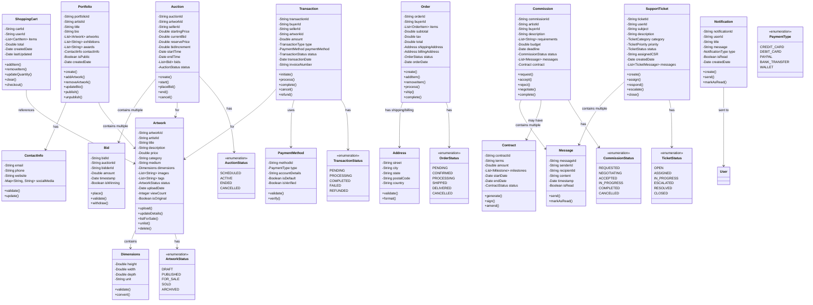

# ArtX Platform - Data Models (Aligned with System Requirements)

```mermaid
classDiagram
    %% Core Data Entities
    class Artwork {
        -String artworkId
        -String artistId
        -String title
        -String description
        -Double price
        -String category
        -String medium
        -Dimensions dimensions
        -List~String~ images
        -List~String~ tags
        -ArtworkStatus status
        -Date uploadDate
        -Integer viewCount
        -Boolean isOriginal
        +upload()
        +updateDetails()
        +listForSale()
        +unlist()
        +delete()
    }

    class Portfolio {
        -String portfolioId
        -String artistId
        -String title
        -String bio
        -List~Artwork~ artworks
        -List~String~ exhibitions
        -List~String~ awards
        -ContactInfo contactInfo
        -Boolean isPublic
        -Date createdDate
        +create()
        +addArtwork()
        +removeArtwork()
        +updateBio()
        +publish()
        +unpublish()
    }

    class Transaction {
        -String transactionId
        -String buyerId
        -String sellerId
        -String artworkId
        -Double amount
        -TransactionType type
        -PaymentMethod paymentMethod
        -TransactionStatus status
        -Date transactionDate
        -String invoiceNumber
        +initiate()
        +process()
        +complete()
        +cancel()
        +refund()
    }

    class Commission {
        -String commissionId
        -String artistId
        -String buyerId
        -String description
        -List~String~ requirements
        -Double budget
        -Date deadline
        -CommissionStatus status
        -List~Message~ messages
        -Contract contract
        +request()
        +accept()
        +reject()
        +negotiate()
        +complete()
    }

    class Auction {
        -String auctionId
        -String artworkId
        -String sellerId
        -Double startingPrice
        -Double currentBid
        -Double reservePrice
        -Double bidIncrement
        -Date startTime
        -Date endTime
        -List~Bid~ bids
        -AuctionStatus status
        +create()
        +start()
        +placeBid()
        +end()
        +cancel()
    }

    class Bid {
        -String bidId
        -String auctionId
        -String bidderId
        -Double amount
        -Date timestamp
        -Boolean isWinning
        +place()
        +validate()
        +withdraw()
    }

    class SupportTicket {
        -String ticketId
        -String userId
        -String subject
        -String description
        -TicketCategory category
        -TicketPriority priority
        -TicketStatus status
        -String assignedCSR
        -Date createdDate
        -List~TicketMessage~ messages
        +create()
        +assign()
        +respond()
        +escalate()
        +close()
    }

    class Order {
        -String orderId
        -String buyerId
        -List~OrderItem~ items
        -Double subtotal
        -Double tax
        -Double total
        -Address shippingAddress
        -Address billingAddress
        -OrderStatus status
        -Date orderDate
        +create()
        +addItem()
        +removeItem()
        +process()
        +ship()
        +complete()
    }

    class ShoppingCart {
        -String cartId
        -String userId
        -List~CartItem~ items
        -Double total
        -Date createdDate
        -Date lastUpdated
        +addItem()
        +removeItem()
        +updateQuantity()
        +clear()
        +checkout()
    }

    %% Value Objects
    class Address {
        -String street
        -String city
        -String state
        -String postalCode
        -String country
        +validate()
        +format()
    }

    class ContactInfo {
        -String email
        -String phone
        -String website
        -Map~String, String~ socialMedia
        +validate()
        +update()
    }

    class Dimensions {
        -Double height
        -Double width
        -Double depth
        -String unit
        +validate()
        +convert()
    }

    class PaymentMethod {
        -String methodId
        -PaymentType type
        -String accountDetails
        -Boolean isDefault
        -Boolean isVerified
        +validate()
        +verify()
    }

    class Contract {
        -String contractId
        -String terms
        -Double amount
        -List~Milestone~ milestones
        -Date startDate
        -Date endDate
        -ContractStatus status
        +generate()
        +sign()
        +amend()
    }

    class Message {
        -String messageId
        -String senderId
        -String recipientId
        -String content
        -Date timestamp
        -Boolean isRead
        +send()
        +markAsRead()
    }

    class Notification {
        -String notificationId
        -String userId
        -String title
        -String message
        -NotificationType type
        -Boolean isRead
        -Date createdDate
        +create()
        +send()
        +markAsRead()
    }

    %% Enumerations
    class ArtworkStatus {
        <<enumeration>>
        DRAFT
        PUBLISHED
        FOR_SALE
        SOLD
        ARCHIVED
    }

    class TransactionStatus {
        <<enumeration>>
        PENDING
        PROCESSING
        COMPLETED
        FAILED
        REFUNDED
    }

    class CommissionStatus {
        <<enumeration>>
        REQUESTED
        NEGOTIATING
        ACCEPTED
        IN_PROGRESS
        COMPLETED
        CANCELLED
    }

    class AuctionStatus {
        <<enumeration>>
        SCHEDULED
        ACTIVE
        ENDED
        CANCELLED
    }

    class TicketStatus {
        <<enumeration>>
        OPEN
        ASSIGNED
        IN_PROGRESS
        ESCALATED
        RESOLVED
        CLOSED
    }

    class OrderStatus {
        <<enumeration>>
        PENDING
        CONFIRMED
        PROCESSING
        SHIPPED
        DELIVERED
        CANCELLED
    }

    class PaymentType {
        <<enumeration>>
        CREDIT_CARD
        DEBIT_CARD
        PAYPAL
        BANK_TRANSFER
        WALLET
    }

    %% Relationships
    Artwork --> ArtworkStatus : has
    Artwork --> Dimensions : contains
    Portfolio --> Artwork : contains multiple
    Portfolio --> ContactInfo : has
    Transaction --> TransactionStatus : has
    Transaction --> PaymentMethod : uses
    Transaction --> Artwork : for
    Commission --> CommissionStatus : has
    Commission --> Contract : may have
    Commission --> Message : contains multiple
    Auction --> AuctionStatus : has
    Auction --> Artwork : for
    Auction --> Bid : contains multiple
    SupportTicket --> TicketStatus : has
    SupportTicket --> Message : contains multiple
    Order --> OrderStatus : has
    Order --> Address : has shipping/billing
    ShoppingCart --> Artwork : references
    Notification --> User : sent to
```

