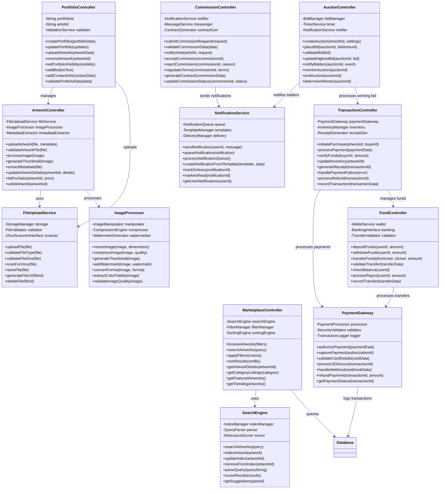

# ArtX Platform - Marketplace Components (Aligned with Sequence Diagrams)

```mermaid
classDiagram
    %% Core Marketplace Controller
    class MarketplaceController {
        -SearchEngine searchEngine
        -FilterManager filterManager
        -SortingEngine sortingEngine
        +browseArtworks(filters)
        +searchArtworks(query)
        +applyFilters(criteria)
        +sortResults(sortBy)
        +getArtworkDetails(artworkId)
        +getCategoryListings(category)
        +getFeaturedArtworks()
        +getTrendingArtworks()
    }

    %% Portfolio Management
    class PortfolioController {
        -String portfolioId
        -String artistId
        -ValidationService validator
        +createPortfolio(portfolioData)
        +updatePortfolio(updates)
        +uploadArtwork(artworkData)
        +removeArtwork(artworkId)
        +setPortfolioVisibility(visibility)
        +addBio(bioText)
        +addContactInfo(contactData)
        +validatePortfolioData(data)
    }

    %% Artwork Management
    class ArtworkController {
        -FileUploadService fileService
        -ImageProcessor imageProcessor
        -MetadataExtractor metadataExtractor
        +uploadArtwork(file, metadata)
        +validateArtworkFile(file)
        +processImage(image)
        +generateThumbnail(image)
        +extractMetadata(file)
        +updateArtworkDetails(artworkId, details)
        +listForSale(artworkId, price)
        +unlistArtwork(artworkId)
    }

    %% Transaction Processing
    class TransactionController {
        -PaymentGateway paymentGateway
        -InventoryManager inventory
        -ReceiptGenerator receiptGen
        +initiatePurchase(artworkId, buyerId)
        +processPayment(paymentData)
        +verifyFunds(buyerId, amount)
        +updateInventory(artworkId)
        +generateReceipt(transactionId)
        +handlePaymentFailure(error)
        +processRefund(transactionId)
        +recordTransaction(transactionData)
    }

    %% Commission Management
    class CommissionController {
        -NotificationService notifier
        -MessageService messenger
        -ContractGenerator contractGen
        +submitCommissionRequest(request)
        +validateCommissionData(data)
        +notifyArtist(artistId, request)
        +acceptCommission(commissionId)
        +rejectCommission(commissionId, reason)
        +negotiateTerms(commissionId, terms)
        +generateContract(commissionData)
        +updateCommissionStatus(commissionId, status)
    }

    %% Auction System
    class AuctionController {
        -BidManager bidManager
        -TimerService timer
        -NotificationService notifier
        +createAuction(artworkId, settings)
        +placeBid(auctionId, bidAmount)
        +validateBid(bid)
        +updateHighestBid(auctionId, bid)
        +notifyBidders(auctionId, event)
        +monitorAuction(auctionId)
        +endAuction(auctionId)
        +determineWinner(auctionId)
    }

    %% Payment Processing
    class PaymentGateway {
        -PaymentProcessor processor
        -SecurityValidator validator
        -TransactionLogger logger
        +authorizePayment(paymentData)
        +capturePayment(authorizationId)
        +validateCardDetails(cardData)
        +process3DSecure(transactionId)
        +handleWebhook(webhookData)
        +refundPayment(transactionId, amount)
        +getPaymentStatus(transactionId)
    }

    %% Fund Management
    class FundController {
        -WalletService wallet
        -BankingInterface banking
        -TransferValidator validator
        +depositFunds(userId, amount)
        +withdrawFunds(userId, amount)
        +transferFunds(fromUser, toUser, amount)
        +validateTransfer(transferData)
        +checkBalance(userId)
        +processPayout(userId, amount)
        +recordTransfer(transferData)
    }

    %% Search and Filter Engine
    class SearchEngine {
        -IndexManager indexManager
        -QueryParser parser
        -RelevanceScorer scorer
        +searchArtworks(query)
        +indexArtwork(artwork)
        +updateIndex(artworkId)
        +removeFromIndex(artworkId)
        +parseQuery(queryString)
        +scoreResults(results)
        +getSuggestions(partial)
    }

    %% Notification System
    class NotificationService {
        -NotificationQueue queue
        -TemplateManager templates
        -DeliveryManager delivery
        +sendNotification(userId, message)
        +queueNotification(notification)
        +processNotificationQueue()
        +createNotificationFromTemplate(template, data)
        +trackDelivery(notificationId)
        +markAsRead(notificationId)
        +getUserNotifications(userId)
    }

    %% File Upload Service
    class FileUploadService {
        -StorageManager storage
        -FileValidator validator
        -VirusScannerInterface scanner
        +uploadFile(file)
        +validateFileType(file)
        +validateFileSize(file)
        +scanForVirus(file)
        +storeFile(file)
        +generateFileUrl(fileId)
        +deleteFile(fileId)
    }

    %% Image Processing
    class ImageProcessor {
        -ImageManipulator manipulator
        -CompressionEngine compressor
        -WatermarkGenerator watermarker
        +resizeImage(image, dimensions)
        +compressImage(image, quality)
        +generateThumbnail(image)
        +addWatermark(image, watermark)
        +convertFormat(image, format)
        +extractColorPalette(image)
        +validateImageQuality(image)
    }

    %% Relationships
    MarketplaceController --> SearchEngine : uses
    MarketplaceController --> Database : queries
    PortfolioController --> ArtworkController : manages
    PortfolioController --> FileUploadService : uploads
    ArtworkController --> FileUploadService : uses
    ArtworkController --> ImageProcessor : processes
    TransactionController --> PaymentGateway : processes payments
    TransactionController --> FundController : manages funds
    CommissionController --> NotificationService : sends notifications
    AuctionController --> NotificationService : notifies bidders
    AuctionController --> TransactionController : processes winning bid
    PaymentGateway --> Database : logs transactions
    FundController --> PaymentGateway : processes transfers
```

