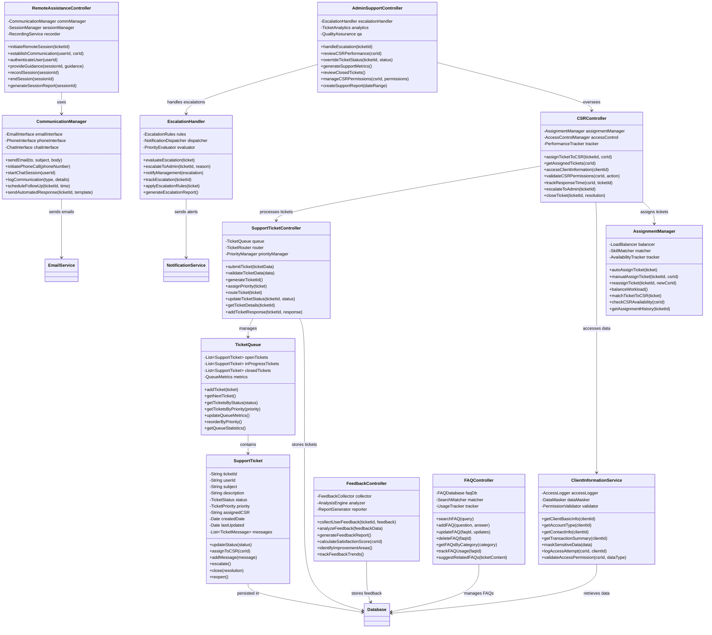

# ArtX Platform - Support System Components (Aligned with Sequence Diagrams)

```mermaid
classDiagram
    %% Support Ticket Management
    class SupportTicketController {
        -TicketQueue queue
        -TicketRouter router
        -PriorityManager priorityManager
        +submitTicket(ticketData)
        +validateTicketData(data)
        +generateTicketId()
        +assignPriority(ticket)
        +routeTicket(ticket)
        +updateTicketStatus(ticketId, status)
        +getTicketDetails(ticketId)
        +addTicketResponse(ticketId, response)
    }

    %% CSR Management System
    class CSRController {
        -AssignmentManager assignmentManager
        -AccessControlManager accessControl
        -PerformanceTracker tracker
        +assignTicketToCSR(ticketId, csrId)
        +getAssignedTickets(csrId)
        +accessClientInformation(clientId)
        +validateCSRPermissions(csrId, action)
        +trackResponseTime(csrId, ticketId)
        +escalateToAdmin(ticketId)
        +closeTicket(ticketId, resolution)
    }

    %% Remote Assistance
    class RemoteAssistanceController {
        -CommunicationManager commManager
        -SessionManager sessionManager
        -RecordingService recorder
        +initiateRemoteSession(ticketId)
        +establishCommunication(userId, csrId)
        +authenticateUser(userId)
        +provideGuidance(sessionId, guidance)
        +recordSession(sessionId)
        +endSession(sessionId)
        +generateSessionReport(sessionId)
    }

    %% Admin Support Functions
    class AdminSupportController {
        -EscalationHandler escalationHandler
        -TicketAnalytics analytics
        -QualityAssurance qa
        +handleEscalation(ticketId)
        +reviewCSRPerformance(csrId)
        +overrideTicketStatus(ticketId, status)
        +generateSupportMetrics()
        +reviewClosedTickets()
        +manageCSRPermissions(csrId, permissions)
        +createSupportReport(dateRange)
    }

    %% Ticket Queue Management
    class TicketQueue {
        -List~SupportTicket~ openTickets
        -List~SupportTicket~ inProgressTickets
        -List~SupportTicket~ closedTickets
        -QueueMetrics metrics
        +addTicket(ticket)
        +getNextTicket()
        +getTicketsByStatus(status)
        +getTicketsByPriority(priority)
        +updateQueueMetrics()
        +reorderByPriority()
        +getQueueStatistics()
    }

    %% Support Ticket Entity
    class SupportTicket {
        -String ticketId
        -String userId
        -String subject
        -String description
        -TicketStatus status
        -TicketPriority priority
        -String assignedCSR
        -Date createdDate
        -Date lastUpdated
        -List~TicketMessage~ messages
        +updateStatus(status)
        +assignToCSR(csrId)
        +addMessage(message)
        +escalate()
        +close(resolution)
        +reopen()
    }

    %% Communication Management
    class CommunicationManager {
        -EmailInterface emailInterface
        -PhoneInterface phoneInterface
        -ChatInterface chatInterface
        +sendEmail(to, subject, body)
        +initiatePhoneCall(phoneNumber)
        +startChatSession(userId)
        +logCommunication(type, details)
        +scheduleFollowUp(ticketId, time)
        +sendAutomatedResponse(ticketId, template)
    }

    %% Client Information Access
    class ClientInformationService {
        -AccessLogger accessLogger
        -DataMasker dataMasker
        -PermissionValidator validator
        +getClientBasicInfo(clientId)
        +getAccountType(clientId)
        +getContactInfo(clientId)
        +getTransactionSummary(clientId)
        +maskSensitiveData(data)
        +logAccessAttempt(csrId, clientId)
        +validateAccessPermission(csrId, dataType)
    }

    %% Ticket Assignment System
    class AssignmentManager {
        -LoadBalancer balancer
        -SkillMatcher matcher
        -AvailabilityTracker tracker
        +autoAssignTicket(ticket)
        +manualAssignTicket(ticketId, csrId)
        +reassignTicket(ticketId, newCsrId)
        +balanceWorkload()
        +matchTicketToCSR(ticket)
        +checkCSRAvailability(csrId)
        +getAssignmentHistory(ticketId)
    }

    %% Feedback System
    class FeedbackController {
        -FeedbackCollector collector
        -AnalysisEngine analyzer
        -ReportGenerator reporter
        +collectUserFeedback(ticketId, feedback)
        +analyzeFeedback(feedbackData)
        +generateFeedbackReport()
        +calculateSatisfactionScore(csrId)
        +identifyImprovementAreas()
        +trackFeedbackTrends()
    }

    %% FAQ Management
    class FAQController {
        -FAQDatabase faqDb
        -SearchMatcher matcher
        -UsageTracker tracker
        +searchFAQ(query)
        +addFAQ(question, answer)
        +updateFAQ(faqId, updates)
        +deleteFAQ(faqId)
        +getFAQsByCategory(category)
        +trackFAQUsage(faqId)
        +suggestRelatedFAQs(ticketContent)
    }

    %% Escalation Management
    class EscalationHandler {
        -EscalationRules rules
        -NotificationDispatcher dispatcher
        -PriorityEvaluator evaluator
        +evaluateEscalation(ticket)
        +escalateToAdmin(ticketId, reason)
        +notifyManagement(escalation)
        +trackEscalation(ticketId)
        +applyEscalationRules(ticket)
        +generateEscalationReport()
    }

    %% Relationships
    SupportTicketController --> TicketQueue : manages
    SupportTicketController --> Database : stores tickets
    CSRController --> SupportTicketController : processes tickets
    CSRController --> ClientInformationService : accesses data
    CSRController --> AssignmentManager : assigns tickets
    RemoteAssistanceController --> CommunicationManager : uses
    AdminSupportController --> EscalationHandler : handles escalations
    AdminSupportController --> CSRController : oversees
    TicketQueue --> SupportTicket : contains
    SupportTicket --> Database : persisted in
    CommunicationManager --> EmailService : sends emails
    ClientInformationService --> Database : retrieves data
    FeedbackController --> Database : stores feedback
    FAQController --> Database : manages FAQs
    EscalationHandler --> NotificationService : sends alerts
```

