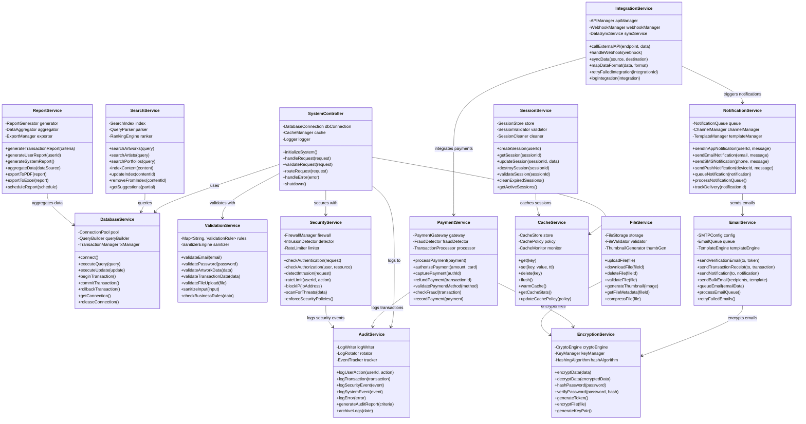

# ArtX Platform - System Services Layer (Aligned with Sequence Diagrams)

```mermaid
classDiagram
    %% Core System Services
    class SystemController {
        -DatabaseConnection dbConnection
        -CacheManager cache
        -Logger logger
        +initializeSystem()
        +handleRequest(request)
        +validateRequest(request)
        +routeRequest(request)
        +handleError(error)
        +shutdown()
    }

    %% Database Services
    class DatabaseService {
        -ConnectionPool pool
        -QueryBuilder queryBuilder
        -TransactionManager txManager
        +connect()
        +executeQuery(query)
        +executeUpdate(update)
        +beginTransaction()
        +commitTransaction()
        +rollbackTransaction()
        +getConnection()
        +releaseConnection()
    }

    %% Validation Services
    class ValidationService {
        -Map~String, ValidationRule~ rules
        -SanitizerEngine sanitizer
        +validateEmail(email)
        +validatePassword(password)
        +validateArtworkData(data)
        +validateTransactionData(data)
        +validateFileUpload(file)
        +sanitizeInput(input)
        +checkBusinessRules(data)
    }

    %% Email Services
    class EmailService {
        -SMTPConfig config
        -EmailQueue queue
        -TemplateEngine templateEngine
        +sendVerificationEmail(to, token)
        +sendTransactionReceipt(to, transaction)
        +sendNotification(to, notification)
        +sendBulkEmail(recipients, template)
        +queueEmail(emailData)
        +processEmailQueue()
        +retryFailedEmails()
    }

    %% Encryption Services
    class EncryptionService {
        -CryptoEngine cryptoEngine
        -KeyManager keyManager
        -HashingAlgorithm hashAlgorithm
        +encryptData(data)
        +decryptData(encryptedData)
        +hashPassword(password)
        +verifyPassword(password, hash)
        +generateToken()
        +encryptFile(file)
        +generateKeyPair()
    }

    %% Audit and Logging
    class AuditService {
        -LogWriter logWriter
        -LogRotator rotator
        -EventTracker tracker
        +logUserAction(userId, action)
        +logTransaction(transaction)
        +logSecurityEvent(event)
        +logSystemEvent(event)
        +logError(error)
        +generateAuditReport(criteria)
        +archiveLogs(date)
    }

    %% File Management
    class FileService {
        -FileStorage storage
        -FileValidator validator
        -ThumbnailGenerator thumbGen
        +uploadFile(file)
        +downloadFile(fileId)
        +deleteFile(fileId)
        +validateFile(file)
        +generateThumbnail(image)
        +getFileMetadata(fileId)
        +compressFile(file)
    }

    %% Payment Services
    class PaymentService {
        -PaymentGateway gateway
        -FraudDetector fraudDetector
        -TransactionProcessor processor
        +processPayment(payment)
        +authorizePayment(amount, card)
        +capturePayment(authId)
        +refundPayment(transactionId)
        +validatePaymentMethod(method)
        +checkFraud(transaction)
        +recordPayment(payment)
    }

    %% Notification Services
    class NotificationService {
        -NotificationQueue queue
        -ChannelManager channelManager
        -TemplateManager templateManager
        +sendInAppNotification(userId, message)
        +sendEmailNotification(email, message)
        +sendSMSNotification(phone, message)
        +sendPushNotification(deviceId, message)
        +queueNotification(notification)
        +processNotificationQueue()
        +trackDelivery(notificationId)
    }

    %% Search Services
    class SearchService {
        -SearchIndex index
        -QueryParser parser
        -RankingEngine ranker
        +searchArtworks(query)
        +searchArtists(query)
        +searchPortfolios(query)
        +indexContent(content)
        +updateIndex(contentId)
        +removeFromIndex(contentId)
        +getSuggestions(partial)
    }

    %% Cache Management
    class CacheService {
        -CacheStore store
        -CachePolicy policy
        -CacheMonitor monitor
        +get(key)
        +set(key, value, ttl)
        +delete(key)
        +flush()
        +warmCache()
        +getCacheStats()
        +updateCachePolicy(policy)
    }

    %% Session Management
    class SessionService {
        -SessionStore store
        -SessionValidator validator
        -SessionCleaner cleaner
        +createSession(userId)
        +getSession(sessionId)
        +updateSession(sessionId, data)
        +destroySession(sessionId)
        +validateSession(sessionId)
        +cleanExpiredSessions()
        +getActiveSessions()
    }

    %% Security Services
    class SecurityService {
        -FirewallManager firewall
        -IntrusionDetector detector
        -RateLimiter limiter
        +checkAuthentication(request)
        +checkAuthorization(user, resource)
        +detectIntrusion(request)
        +rateLimit(userId, action)
        +blockIP(ipAddress)
        +scanForThreats(data)
        +enforceSecurityPolicies()
    }

    %% Report Generation
    class ReportService {
        -ReportGenerator generator
        -DataAggregator aggregator
        -ExportManager exporter
        +generateTransactionReport(criteria)
        +generateUserReport(userId)
        +generateSystemReport()
        +aggregateData(dataSource)
        +exportToPDF(report)
        +exportToExcel(report)
        +scheduleReport(schedule)
    }

    %% Integration Services
    class IntegrationService {
        -APIManager apiManager
        -WebhookManager webhookManager
        -DataSyncService syncService
        +callExternalAPI(endpoint, data)
        +handleWebhook(webhook)
        +syncData(source, destination)
        +mapDataFormat(data, format)
        +retryFailedIntegration(integrationId)
        +logIntegration(integration)
    }

    %% Relationships
    SystemController --> DatabaseService : uses
    SystemController --> ValidationService : validates with
    SystemController --> AuditService : logs to
    SystemController --> CacheService : caches with
    SystemController --> SecurityService : secures with
    
    EmailService --> EncryptionService : encrypts emails
    PaymentService --> EncryptionService : encrypts payment data
    FileService --> EncryptionService : encrypts files
    
    NotificationService --> EmailService : sends emails
    PaymentService --> AuditService : logs transactions
    SecurityService --> AuditService : logs security events
    
    SearchService --> DatabaseService : queries
    ReportService --> DatabaseService : aggregates data
    SessionService --> CacheService : caches sessions
    
    IntegrationService --> PaymentService : integrates payments
    IntegrationService --> NotificationService : triggers notifications
```

