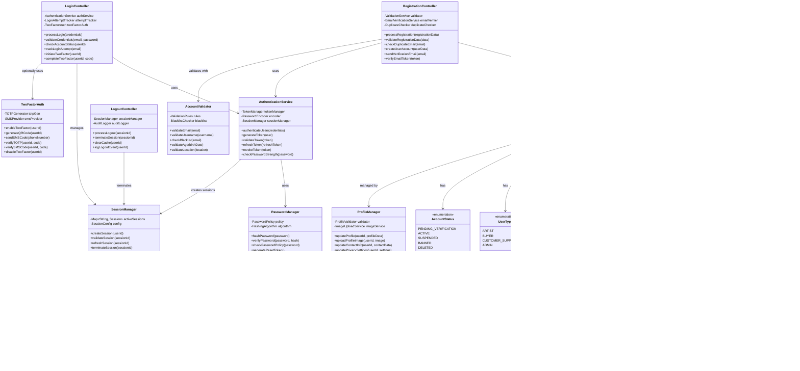

# ArtX Platform - User and Authentication System (Aligned with Sequence Diagrams)

```mermaid
classDiagram
    %% User Base Class
    class User {
        -String userId
        -String email
        -String username
        -String passwordHash
        -UserType userType
        -AccountStatus status
        -Date registrationDate
        -Date lastLoginDate
        -String verificationToken
        -Boolean isVerified
        +register()
        +login()
        +logout()
        +updateProfile()
        +changePassword()
        +verifyEmail()
        +resetPassword()
    }

    %% User Types
    class Artist {
        -String artistId
        -String bio
        -String artistStatement
        -List~String~ specializations
        -Portfolio portfolio
        -Double commissionRate
        -Boolean isApproved
        -Date approvalDate
        +createPortfolio()
        +uploadArtwork()
        +setCommissionRate()
        +acceptCommission()
        +viewEarnings()
    }

    class Buyer {
        -String buyerId
        -Address shippingAddress
        -PaymentMethod paymentMethod
        -List~String~ interests
        -ShoppingCart cart
        -List~String~ watchlist
        +browseMarketplace()
        +purchaseArtwork()
        +requestCommission()
        +placeBid()
        +addToWatchlist()
    }

    class CustomerSupportRep {
        -String csrId
        -String department
        -Integer activeTickets
        -List~String~ specializations
        -ShiftSchedule schedule
        +viewTickets()
        +respondToTicket()
        +escalateTicket()
        +accessClientInfo()
        +provideAssistance()
    }

    class Admin {
        -String adminId
        -AdminLevel level
        -List~Permission~ permissions
        -Date appointmentDate
        +reviewApplications()
        +moderateContent()
        +manageAccounts()
        +viewSystemMetrics()
        +handleEscalations()
    }

    %% Authentication Components
    class AuthenticationService {
        -TokenManager tokenManager
        -PasswordEncoder encoder
        -SessionManager sessionManager
        +authenticateUser(credentials)
        +generateToken(user)
        +validateToken(token)
        +refreshToken(refreshToken)
        +revokeToken(token)
        +checkPasswordStrength(password)
    }

    class SessionManager {
        -Map~String, Session~ activeSessions
        -SessionConfig config
        +createSession(userId)
        +validateSession(sessionId)
        +refreshSession(sessionId)
        +terminateSession(sessionId)
        +cleanupExpiredSessions()
        +getActiveSessionCount()
    }

    class Session {
        -String sessionId
        -String userId
        -String token
        -Date createdAt
        -Date expiresAt
        -Date lastActivity
        -String ipAddress
        -String userAgent
        +isValid()
        +refresh()
        +terminate()
        +updateActivity()
    }

    %% Registration Components
    class RegistrationController {
        -ValidationService validator
        -EmailVerificationService emailVerifier
        -DuplicateChecker duplicateChecker
        +processRegistration(registrationData)
        +validateRegistrationData(data)
        +checkDuplicateEmail(email)
        +createUserAccount(userData)
        +sendVerificationEmail(email)
        +verifyEmailToken(token)
    }

    class LoginController {
        -AuthenticationService authService
        -LoginAttemptTracker attemptTracker
        -TwoFactorAuth twoFactorAuth
        +processLogin(credentials)
        +validateCredentials(email, password)
        +checkAccountStatus(userId)
        +trackLoginAttempt(email)
        +initiateTwoFactor(userId)
        +completeTwoFactor(userId, code)
    }

    class LogoutController {
        -SessionManager sessionManager
        -AuditLogger auditLogger
        +processLogout(sessionId)
        +terminateSession(sessionId)
        +clearCache(userId)
        +logLogoutEvent(userId)
    }

    %% Security Components
    class PasswordManager {
        -PasswordPolicy policy
        -HashingAlgorithm algorithm
        +hashPassword(password)
        +verifyPassword(password, hash)
        +checkPasswordPolicy(password)
        +generateResetToken()
        +resetPassword(token, newPassword)
    }

    class TwoFactorAuth {
        -TOTPGenerator totpGen
        -SMSProvider smsProvider
        +enableTwoFactor(userId)
        +generateQRCode(userId)
        +sendSMSCode(phoneNumber)
        +verifyTOTP(userId, code)
        +verifySMSCode(userId, code)
        +disableTwoFactor(userId)
    }

    class AccountValidator {
        -ValidationRules rules
        -BlacklistChecker blacklist
        +validateEmail(email)
        +validateUsername(username)
        +checkBlacklist(email)
        +validateAge(birthDate)
        +validateLocation(location)
    }

    %% Profile Management
    class ProfileManager {
        -ProfileValidator validator
        -ImageUploadService imageService
        +updateProfile(userId, profileData)
        +uploadProfileImage(userId, image)
        +updateContactInfo(userId, contactData)
        +updatePrivacySettings(userId, settings)
        +deleteAccount(userId)
    }

    %% Enums
    class UserType {
        <<enumeration>>
        ARTIST
        BUYER
        CUSTOMER_SUPPORT
        ADMIN
    }

    class AccountStatus {
        <<enumeration>>
        PENDING_VERIFICATION
        ACTIVE
        SUSPENDED
        BANNED
        DELETED
    }

    class AdminLevel {
        <<enumeration>>
        JUNIOR_ADMIN
        SENIOR_ADMIN
        SUPER_ADMIN
    }

    %% Relationships
    User <|-- Artist : inherits
    User <|-- Buyer : inherits
    User <|-- CustomerSupportRep : inherits
    User <|-- Admin : inherits
    
    User --> UserType : has
    User --> AccountStatus : has
    Admin --> AdminLevel : has
    
    RegistrationController --> User : creates
    RegistrationController --> AuthenticationService : uses
    LoginController --> AuthenticationService : uses
    LoginController --> SessionManager : manages
    LogoutController --> SessionManager : terminates
    
    AuthenticationService --> PasswordManager : uses
    AuthenticationService --> SessionManager : creates sessions
    SessionManager --> Session : manages
    
    LoginController --> TwoFactorAuth : optionally uses
    RegistrationController --> AccountValidator : validates with
    User --> ProfileManager : managed by
```

