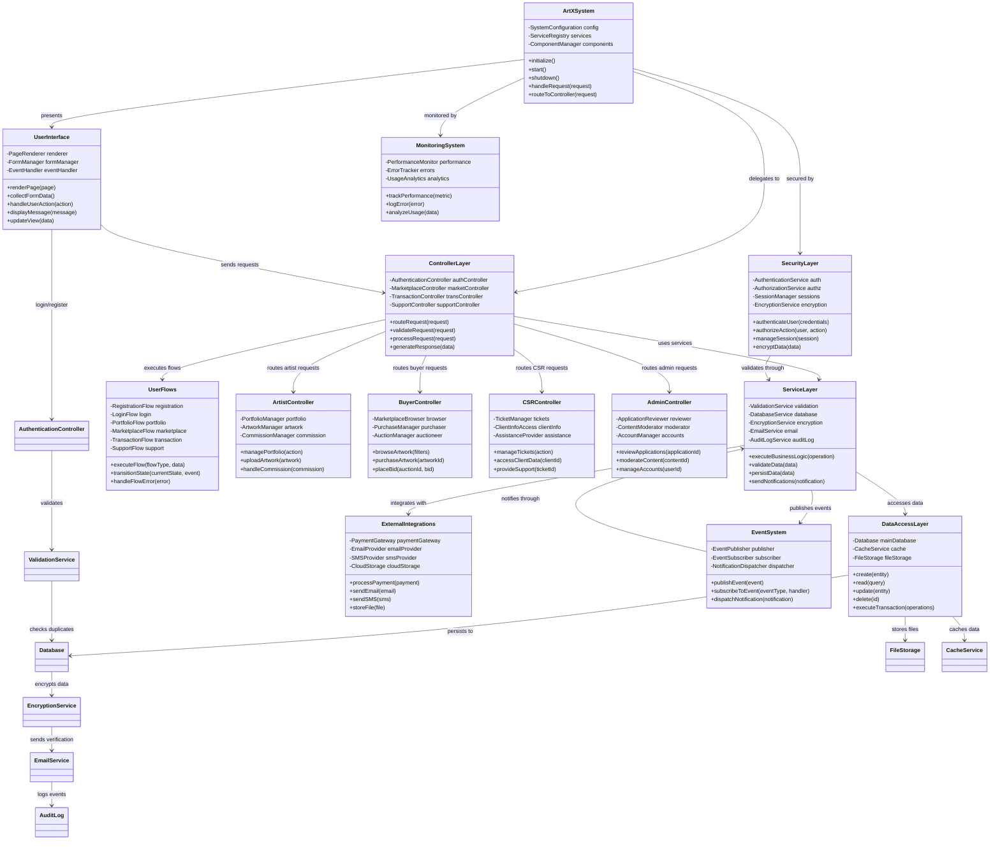

# ArtX Platform - Complete System Integration (Sequence Diagram Alignment)

```mermaid
classDiagram
    %% Main System Entry Point
    class ArtXSystem {
        -SystemConfiguration config
        -ServiceRegistry services
        -ComponentManager components
        +initialize()
        +start()
        +shutdown()
        +handleRequest(request)
        +routeToController(request)
    }

    %% User Interface Layer (as shown in sequences)
    class UserInterface {
        -PageRenderer renderer
        -FormManager formManager
        -EventHandler eventHandler
        +renderPage(page)
        +collectFormData()
        +handleUserAction(action)
        +displayMessage(message)
        +updateView(data)
    }

    %% Controller Layer (from sequence diagrams)
    class ControllerLayer {
        -AuthenticationController authController
        -MarketplaceController marketController
        -TransactionController transController
        -SupportController supportController
        +routeRequest(request)
        +validateRequest(request)
        +processRequest(request)
        +generateResponse(data)
    }

    %% Service Layer (from sequence diagrams)
    class ServiceLayer {
        -ValidationService validation
        -DatabaseService database
        -EncryptionService encryption
        -EmailService email
        -AuditLogService auditLog
        +executeBusinessLogic(operation)
        +validateData(data)
        +persistData(data)
        +sendNotifications(notification)
    }

    %% Data Access Layer
    class DataAccessLayer {
        -Database mainDatabase
        -CacheService cache
        -FileStorage fileStorage
        +create(entity)
        +read(query)
        +update(entity)
        +delete(id)
        +executeTransaction(operations)
    }

    %% Integration Points (from sequences)
    class ExternalIntegrations {
        -PaymentGateway paymentGateway
        -EmailProvider emailProvider
        -SMSProvider smsProvider
        -CloudStorage cloudStorage
        +processPayment(payment)
        +sendEmail(email)
        +sendSMS(sms)
        +storeFile(file)
    }

    %% Main User Flows (STD alignment)
    class UserFlows {
        -RegistrationFlow registration
        -LoginFlow login
        -PortfolioFlow portfolio
        -MarketplaceFlow marketplace
        -TransactionFlow transaction
        -SupportFlow support
        +executeFlow(flowType, data)
        +transitionState(currentState, event)
        +handleFlowError(error)
    }

    %% Actor-Specific Controllers
    class ArtistController {
        -PortfolioManager portfolio
        -ArtworkManager artwork
        -CommissionManager commission
        +managePortfolio(action)
        +uploadArtwork(artwork)
        +handleCommission(commission)
    }

    class BuyerController {
        -MarketplaceBrowser browser
        -PurchaseManager purchaser
        -AuctionManager auctioneer
        +browseArtwork(filters)
        +purchaseArtwork(artworkId)
        +placeBid(auctionId, bid)
    }

    class CSRController {
        -TicketManager tickets
        -ClientInfoAccess clientInfo
        -AssistanceProvider assistance
        +manageTickets(action)
        +accessClientData(clientId)
        +provideSupport(ticketId)
    }

    class AdminController {
        -ApplicationReviewer reviewer
        -ContentModerator moderator
        -AccountManager accounts
        +reviewApplications(applicationId)
        +moderateContent(contentId)
        +manageAccounts(userId)
    }

    %% Security & Authentication (from sequences)
    class SecurityLayer {
        -AuthenticationService auth
        -AuthorizationService authz
        -SessionManager sessions
        -EncryptionService encryption
        +authenticateUser(credentials)
        +authorizeAction(user, action)
        +manageSession(session)
        +encryptData(data)
    }

    %% Event Management System
    class EventSystem {
        -EventPublisher publisher
        -EventSubscriber subscriber
        -NotificationDispatcher dispatcher
        +publishEvent(event)
        +subscribeToEvent(eventType, handler)
        +dispatchNotification(notification)
    }

    %% System Monitoring
    class MonitoringSystem {
        -PerformanceMonitor performance
        -ErrorTracker errors
        -UsageAnalytics analytics
        +trackPerformance(metric)
        +logError(error)
        +analyzeUsage(data)
    }

    %% Main Relationships (following sequence diagram flows)
    ArtXSystem --> UserInterface : presents
    ArtXSystem --> ControllerLayer : delegates to
    ArtXSystem --> SecurityLayer : secured by
    ArtXSystem --> MonitoringSystem : monitored by
    
    UserInterface --> ControllerLayer : sends requests
    ControllerLayer --> ServiceLayer : uses services
    ControllerLayer --> UserFlows : executes flows
    
    ControllerLayer --> ArtistController : routes artist requests
    ControllerLayer --> BuyerController : routes buyer requests
    ControllerLayer --> CSRController : routes CSR requests
    ControllerLayer --> AdminController : routes admin requests
    
    ServiceLayer --> DataAccessLayer : accesses data
    ServiceLayer --> ExternalIntegrations : integrates with
    ServiceLayer --> EventSystem : publishes events
    
    SecurityLayer --> ServiceLayer : validates through
    EventSystem --> ServiceLayer : notifies through
    
    DataAccessLayer --> Database : persists to
    DataAccessLayer --> FileStorage : stores files
    DataAccessLayer --> CacheService : caches data
    
    %% Sequence Diagram Specific Flows
    UserInterface --> AuthenticationController : login/register
    AuthenticationController --> ValidationService : validates
    ValidationService --> Database : checks duplicates
    Database --> EncryptionService : encrypts data
    EncryptionService --> EmailService : sends verification
    EmailService --> AuditLog : logs events
```

