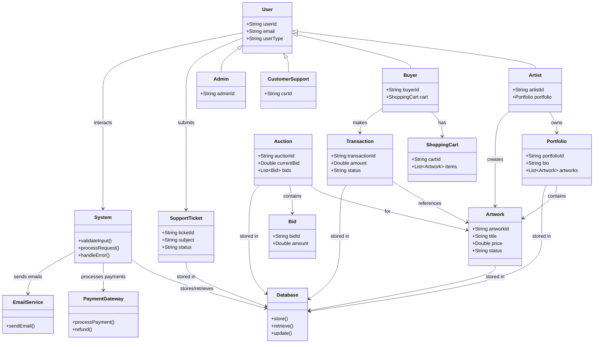

# ArtX Platform - Simple Class Diagram Overview

A simplified class structure covering all activity and sequence diagram flows.

## Covered Activity Flows

This simple diagram supports all the following activity/sequence flows:

### User Management
- **Registration**: User → System → Database + EmailService
- **Login**: User → System → Database
- **Authentication**: System validates credentials from Database

### Artist Activities
- **Portfolio Creation**: Artist → System → Database (Admin approval)
- **Artwork Upload**: Artist → Artwork → System → Database
- **Artwork Listing**: Artist → Artwork → System → Database (Admin review)

### Buyer Activities
- **Marketplace Browsing**: Buyer → System → Database (retrieve artworks)
- **Purchase**: Buyer → Transaction → System → PaymentGateway → Database
- **Auction Participation**: Buyer → Bid → Auction → System → Database

### Financial Operations
- **Fund Transfer**: User → System → PaymentGateway → Database
- **Transaction History**: User → System → Database

### Support System
- **Ticket Submission**: User → SupportTicket → System → Database + EmailService
- **Ticket Management**: CustomerSupport → SupportTicket → System → Database

### Admin Functions
- **Application Review**: Admin → System → Database
- **Content Moderation**: Admin → System → Database
